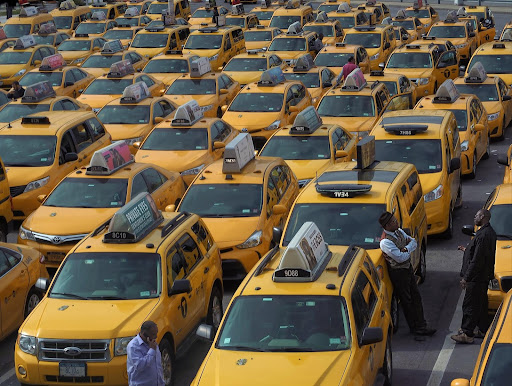
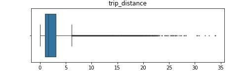
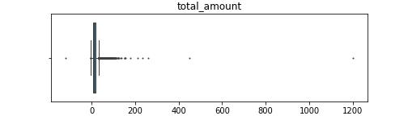
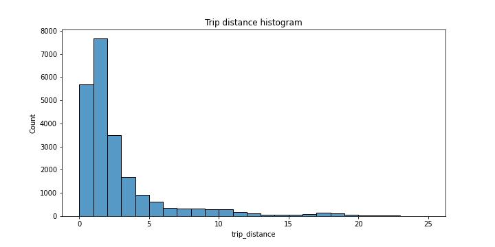
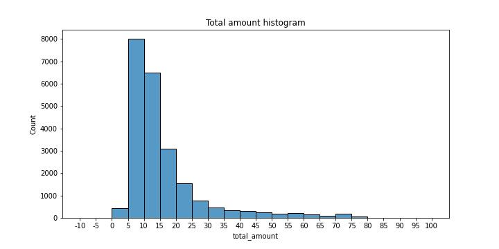
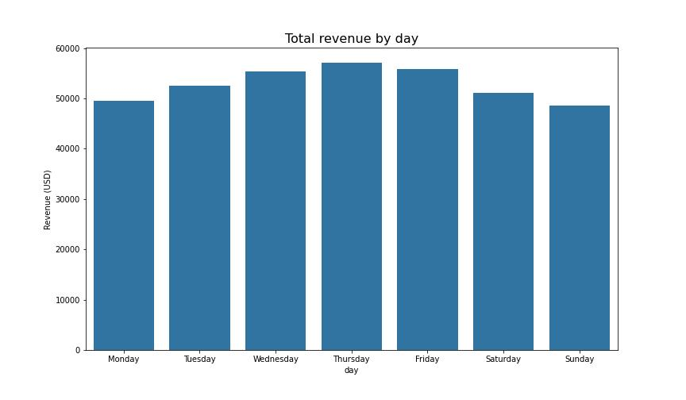
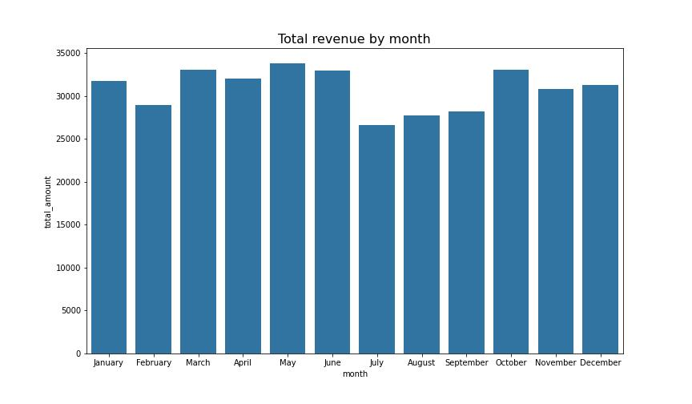
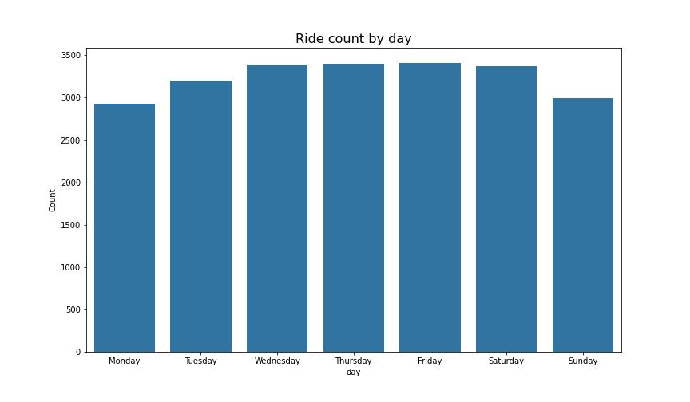
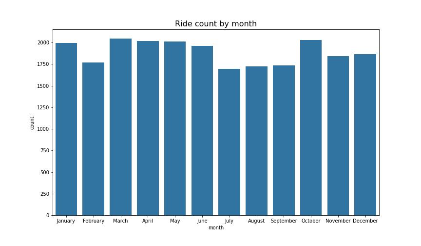

#  Taxi Fare Prediction Model
This project's goal is to build a regression model that predicts taxi cab fares before each ride based on distance, time of day, and any additional variables we find necessary.
### TLDR Presentation [LINK](https://docs.google.com/presentation/d/1I3PJeAL6wSCZCT8FXa4GtsFjZeRMaZ67nGlbKEv-jzA/edit?usp=sharing).
  

# Table of Contents

1. [Exploring the Dataset](#1-|-Exploring-the-Dataset)
1. [Statistical Analysis](#2-|-statistical-analysis)
1. [Building the Model](#3-|-Building-the-Model)
1. [Conclusions](#4-|-conclusions)
1. [Dependencies](#5-|-dependencies)
1. [Author](#6-|-author)
1. [License](#7-|-license)
1. [Acknowledgements](#8-|-acknowledgements)
  

# 1 | Exploring the Dataset
The goal of this first notebook is to perform a cursory inspection of  the 2017 Yellow Taxi Trip data.

After looking at the dataset, the two variables that are most likely to help build a predictive model for taxi ride fares are total_amount and trip_distance because those variables show a picture of a taxi cab ride.
  

# 2 | Statistical Analysis
The goal of this second notebook is to characterize and clean the 2017 Yellow Taxi Trip data set and to create a visualization to share to stakeholders.
- We will use box plots to determine outliers and where the bulk of the data points reside in terms of trip_distance and total_amount.

  
- We will use histograms to visualize the trends and patters and outliers of critical variables, such as trip_distance and total_amount.

  
- We will use bar charts to determine daily and monthly revenue and number of trips.

  

### EDA Presentation [LINK](https://docs.google.com/presentation/d/1I3PJeAL6wSCZCT8FXa4GtsFjZeRMaZ67nGlbKEv-jzA/edit?usp=sharing).
  

# 3 | Building the Model
Under Construction. . .
  

## Observations & Patterns
- A/B Test analysis shows that there is a statistically significant difference between the fare_amount for the credit card payment_type vs the cash payment_type. This suggests there might be more profitable for the taxi company to encourage payments by credit card.

- However, this assumes that passengers were forced to pay one way or the other, and that once informed of this requirement, they always complied with it. The data was not collected this way; so the   randomly grouped data entries to perform an A/B test was based on   an assumption that might necessarily be true.

- This dataset does not account for other likely explanations. For example, riders might not carry lots of cash, so it's easier to pay for longer, long-distance trips with a credit card. In other words, it's far more likely that fare amount determines payment type, rather than vice versa.
  

# 4 | Conclusions

As expected, the model . . .
  

# 5 | Dependencies
* python = "^3.10"
* numpy = "^1.25"
* pandas = "^2.0"
* matplotlib = "^3.8.0"
* seaborn = "^0.13.0"
* scipy = "^1.11.3"
* scikit-learn = "^1.3.1"
  

# 6 | Author
[Ahmed L Rashed](https://ahmedlrashed.github.io)
  

# 7 | License

  

# 8 | Acknowledgements
* [Coursera](https://www.coursera.org/) for hosting the dataset
